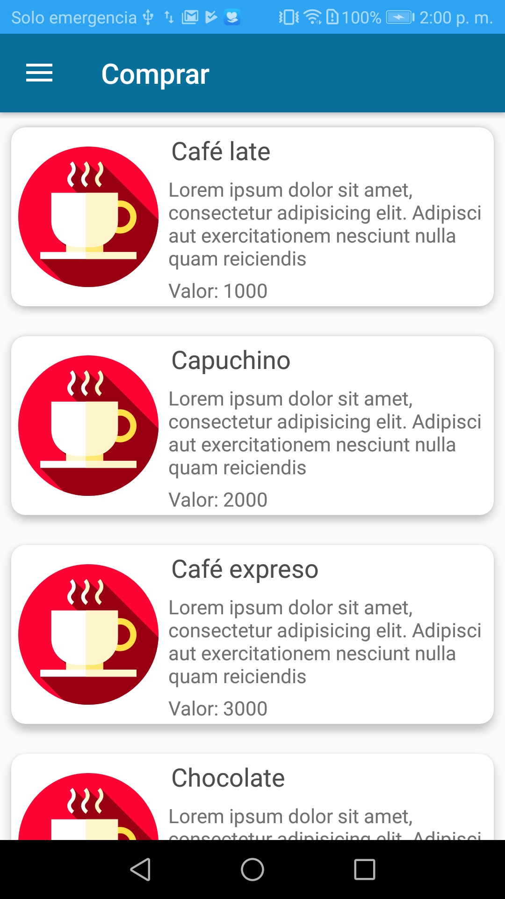
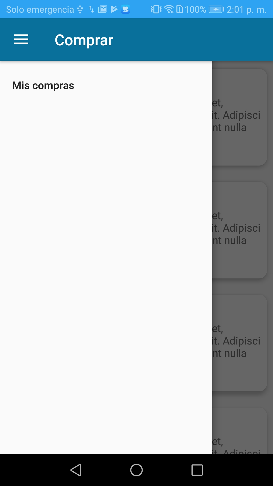
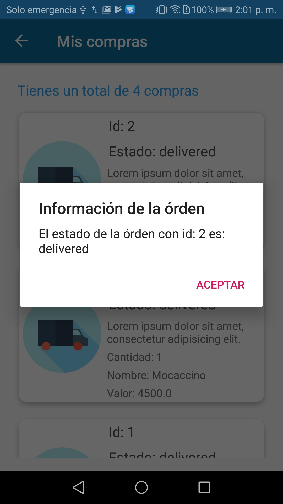

Android Product to pay (alpha)
=========================
Requerimientos:

    -Visual Studio versión 3.3 o superior.
    -Gradle version 3.3.0 o superior.

El proyecto está construído en base a las herramientas proporsionadas por AndroidX (Jetpack), se hizo uso de "navigation" para el
manejo de los fragmentos, envío de parámatros y flujo de los deep links.

Captura de pantallas
-----------

  
